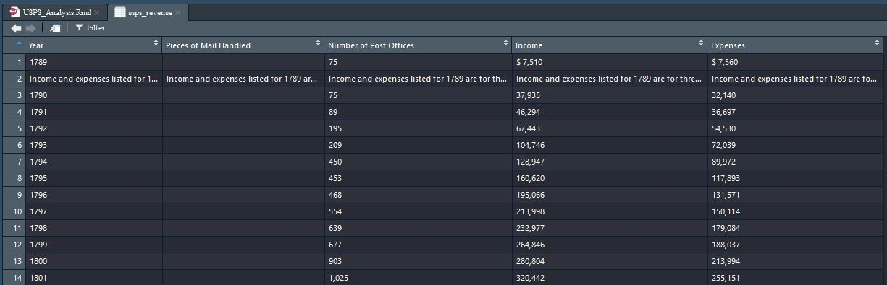
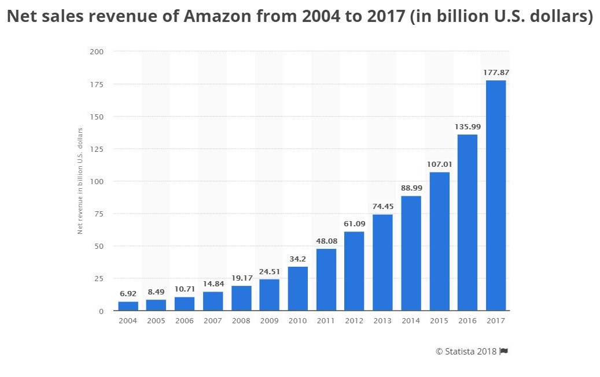

_Van-Nhan Nguyen_

_05-18-2018_

```{r setup, include=FALSE}
knitr::opts_chunk$set(echo = TRUE)
```

## An Exploration of the United States Postal Service over the years

## Motivation
In the current age of e-commerce, social media and other digital interactions, a number of once thriving industries are struggling to remain relevant and up-to-date. The most obvious example of such an industry is the physical newspaper market; one the go to source for the latest news and information, newspapers have, for quite some time, been in decline as a result or televisions and more recently, online news sources, which are arguably less of a hassle to get the latest news. 

In a similar, but less pronounced way to how newspapers are slowly disappearing into obscurity, the United States Postal Service (USPS) seems to be facing a number of the same issues as newspapers; more and more people are relying solely on digital forms of communication such as email and online messengers. And so, in this tutorial, I will be analyzing data from USPS to conclude and predict the current and future state of the Department respectively. In order to analyze this data, I will first have to obtain data directly from USPS. The majority of the tutorial however will be composed of Exploratory Data Analysis in order to visualize and interpret trends. Essentially, we want to answer: Is the United States Postal Service in danger of spending too much on an already declining agency?

## Data Curation, Parsing, and Management

First and foremost, it is necessary to obtain data that will help with our analysis. Consequently, all data used throughout this analysis and tutorial will come from the “About” Section of the USPS website (https://about.usps.com/who-we-are/postal-history/rates-historical-statistics.htm). 

On this website, the first thing to notice is that the data is only available via PDF or HTML. Using a number of data curation techniques however, we will be able scrape for the data we need from the latter data source. To do this, we will be using the “rvest” library, which is specifically deigned to scrape information from web pages. In addition, I will also be using a tool called “Selector Gadget” to easily find the html_node corresponding to the data table we want. More information about this useful tool is available here: “http://selectorgadget.com/”

```{r scrape_revenue_data, message=FALSE}
#rvest helps you scrape information from web pages
library(rvest) 

#link to the USPS dataset to be scraped
url <- "https://about.usps.com/who-we-are/postal-history/pieces-of-mail-since-1789.htm"
usps_revenue <- url %>%
  read_html() %>%
  html_nodes(".MsoNormalTable") %>%
  html_table()

usps_revenue <- usps_revenue[[1]]

head(usps_revenue)
```
#### This data frame shows the raw data scraped from the USPS webiste.

Notice that many issues are immediately present with the data scraped from the HTML page. From the image below of the untouched data, the most glaring issue is the extraneous text that occupies entity cells. Along the same lines as extraneous text is special characters, like the “$” symbol seen in the “Income” and “Expenses” attributes of the first entity. The commas separating digits of large numbers are also unnecessary. In fact, these commas prevent the attribute from being casted from character strings to integers or doubles. Each one of these issues can be fixed by “tidying” the data. Tidying data is an important aspect of data science as it allows the data to be observed, manipulated and visualized in more meaningful ways.  



```{r tidy_revenue_data, message=FALSE}
#Removes extraneous special characters from the the Income and Expenses attributes
usps_revenue$Income <- gsub("[^0-9]", "", usps_revenue$Income)
usps_revenue$Expenses <- gsub("[^0-9]", "", usps_revenue$Expenses)

#Replaces each Year entry that is not a numeric year with 'NA' and then removes these parked rows
usps_revenue$Year <- gsub("^[a-zA-Z].+", "NA", usps_revenue$Year)
usps_revenue <- usps_revenue[usps_revenue$Year != "NA" & usps_revenue$Year != "NA",]

#Renames the 2nd and 3rd attributes so that they do not include spaces; this makes refering to them easier via the dataframe$attribute syntax
colnames(usps_revenue)[2] <- "Mail_Handled"
colnames(usps_revenue)[3] <- "Post_Offices"

#Converts the unit of each atrribute to its intended unit (i.e. Year(character) -> Year(Integer))
usps_revenue$Income <- as.character(usps_revenue$Income)
usps_revenue$Expenses <- as.character(usps_revenue$Expenses)
usps_revenue <- readr::type_convert(usps_revenue)

head(usps_revenue)
```
The above data table shows the final tidy dataset to be used later for analysis; all attributes have been converted from character strings to integers or doubles and all special characters, including commas, and extraneous text have been removed.

For this analysis, we will primarily be working with the “Year”, “Income” and “Expenses” attributes, however you may want to add more information from another table in the future. For example, let’s scrape a different table about the number of employees at the agency from the USPS database. 
```{r scrape_employee_data, message=FALSE}
#link to another data set that will be joined with teh first
url <- "https://about.usps.com/who-we-are/postal-history/employees-since-1926.htm"
usps_employee <- url %>%
  read_html() %>%
  html_nodes(".MsoNormalTable") %>%
  html_table()

usps_employee <- usps_employee[[1]]

#tidying the newly scraped dataset
colnames(usps_employee)[2] <- "Num_Employees"
usps_employee$Num_Employees <- gsub("[^0-9]", "", usps_employee$Num_Employees)
usps_employee$Num_Employees <- as.integer(usps_employee$Num_Employees)

head(usps_employee)
```

Now that we have a separate data frames, we will want to combine them into one. This is easily accomplished using the “dplyer” library. This library gives us access to the left_join function which adds all missing information from one data table to another based on a foreign-like key to establish a connection. In our case, we will be joining the usps_employee table with the usps_revenue table and saving the result as a new table, usps_stats.
```{r join_tables, message=FALSE}
library(dplyr)

#the "Year" atrribute will act as a foreign key in order to connect the two data sets together
usps_stats <- usps_revenue %>%
  left_join(usps_employee, by="Year")

head(usps_stats)
```

## Exploratory Data Analysis
Having all the data we need, it is time to visualize this data in meaningful ways via Exploratory Data Analysis. This paradigm of data science mostly focuses on graphs in order to interpret observations such as linear and non-linear relationships and other trends. In many cases, Exploratory Data Analysis is also used for seeing what the data can tell us beyond the formal modeling or hypothesis testing task due to a historical dataset that can help project the future.

Because we are investigating USPS spending and revenue, we will first determine if there is a relationship between the “income” and “expenses” attributes. To do this, we will create a simple dot plot. 
```{r income_expenses, message=FALSE}
library(ggplot2)

ggplot() + 
  geom_point(data = usps_stats, aes(x = Year, y = Income), color='green') + 
  geom_point(data = usps_stats, aes(x = Year, y = Expenses), color='red') +
  ggtitle("USPS Income and Expenses vs Year") +
  scale_y_continuous(labels = scales::dollar) +
  labs(x = "Year", y = "Income(Green)  and  Expenses(Red)")
```

Admittedly, a relationship, if even existent, is not clear from this plot. Alternative to plotting two different attributes however, we can plot a single new attribute representing USPS Profit, which is calculated by subtracting the amount of expenses from the amount of income. This calculation can be done within the “mutate” function, which automatically adds the resulting profit values to the last column of the data frame. Now using this new profit information, we can again plot the data to get a better sense of when/what years the Post Office makes money verses loses money.
```{r calculate_profit, message=FALSE}
#calculates the profit margin and stores the result within a new attribute
usps_stats <- mutate(usps_stats, Profit = usps_stats$Income - usps_stats$Expenses)
head(usps_stats)

usps_stats %>%
  ggplot(aes(x = Year, y = Profit)) +
    geom_point(aes(colour=Year)) +
    ggtitle("USPS Profit vs Year") +
    scale_y_continuous(labels = scales::dollar) +
    labs(x = "Year", y = "Profit")
```

As you can see, the Profit vs. Year plot gives a much better representation of when the post office makes money and loses money. Based on initial observations, it would seem obvious that the post office made the most money around the year 2000, but then had a significant drop immediately afterwards.

Prior to 1950, the data does not seem too interesting because these is little to no profit or loss. This however is misleading as the extreme values after 1950 will dwarf those prior. In a more practical sense and because we are dealing with money, we must account for inflation; the worth of a dollar in 1900 is not the same as it was in 1950 and the worth of a dollar in 1950 is certainly not the same as that of today. 

In order to account for this change over time, it is necessary to standardize the data. This will allow us to observe the data from an objective point of view that is not hindered by factor like inflation.

```{r standardization, message=FALSE}
options(warn = -1)
usps_std <- usps_stats

# splits the data into different year ranges in order to process each one individually
range <- mutate(usps_stats, Year_Range = cut(Year, breaks=5))
range <- split(range, range$Year_Range)

#this boxplot will reveal any outliers to take into account even after standardizing the data
ggplot() + 
  geom_boxplot(data = range[[1]], aes(x = Year, y = Profit), color='green') +
  geom_boxplot(data = range[[2]], aes(x = Year, y = Profit), color='red') +
  geom_boxplot(data = range[[3]], aes(x = Year, y = Profit), color='blue') +
  geom_boxplot(data = range[[4]], aes(x = Year, y = Profit), color='purple') +
  geom_boxplot(data = range[[5]], aes(x = Year, y = Profit), color='orange') +
  ggtitle("USPS Income and Expenses vs Year (1994 - 2017)") +
  scale_y_continuous(labels = scales::dollar) +
  labs(x = "Year", y = "Income(Green)  and  Expenses(Red)")

#the code below will generate the mean and standard deviation of each year range and add the values to the corresponding year. The standardized profit value will then be calulated using the formula: (Mean - Profit)/Standard_Deviation
usps_std <- mutate(usps_std, Mean = 0)
usps_std <- mutate(usps_std, Std_Dev = 0)

mean <- mean(range[[1]]$Profit)
sd <- sd(range[[1]]$Profit)
usps_std$Mean[usps_std$Year <= 1830] <- mean
usps_std$Std_Div[usps_std$Year <= 1830] <- sd

mean <- mean(range[[2]]$Profit)
sd <- sd(range[[2]]$Profit)
usps_std$Mean[usps_std$Year > 1830 & usps_std$Year <= 1880] <- mean
usps_std$Std_Div[usps_std$Year > 1830 & usps_std$Year <= 1880] <- sd

mean <- mean(range[[3]]$Profit)
sd <- sd(range[[3]]$Profit)
usps_std$Mean[usps_std$Year > 1880 & usps_std$Year <= 1930] <- mean
usps_std$Std_Div[usps_std$Year > 1880 & usps_std$Year <= 1930] <- sd

mean <- mean(range[[4]]$Profit)
sd <- sd(range[[4]]$Profit)
usps_std$Mean[usps_std$Year > 1930 & usps_std$Year <= 1970] <- mean
usps_std$Std_Div[usps_std$Year > 1930 & usps_std$Year <= 1970] <- sd

mean <- mean(range[[5]]$Profit)
sd <- sd(range[[5]]$Profit)
usps_std$Mean[usps_std$Year > 1970] <- mean
usps_std$Std_Div[usps_std$Year > 1970] <- sd

usps_std <- mutate(usps_std, Std_Profit = (Mean - Profit)/Std_Div)

head(usps_std)
```

The first output is a boxplot showing statistics for each of the five year ranges I created. It should be noted that the last range, from 1970 – 2020, contains a number of outliers that should be taken into account when viewing the standardized data outputted as a new data frame called “usps_std”. Comparing the “Std_Profit” with “Profit”, one would notice a significant difference in values as standardized values are typically much smaller than the original values. This is because the calculation utilizes the standard deviation to minimize extraneous and non-significant information.

As before, we will plot our new attribute against time to see if it yields any newer information that was not particularly clear before.

```{r standard_plot, message=FALSE}
usps_std %>%
  ggplot(aes(x = Year, y = Std_Profit)) +
    geom_point(aes(colour=Year)) +
    ggtitle("USPS Standardized Profit vs Year") +
    scale_y_continuous(labels = scales::dollar) +
    labs(x = "Year", y = "Standard Profit") 
```

This time, we can clearly see that there is fluctuating, almost sinusoidal, relationship amongst the data; after a few years of growth, profit then decreases below $0. Indeed, the concentration of data points after 1950 is below a positive profit, but relatively, such drops are not as significant as earlier years. Observing the far-right end of the plot (representing today), the post office currently seems to be in decline once again. Let’s take a look at these more recent years from 1900 to 2017.

```{r standard_recent, message=FALSE}
usps_std <- usps_std[usps_std$Year >= 1990,]

usps_std %>%
  ggplot(aes(x = Year, y = Std_Profit)) +
    geom_point(aes(colour=Year)) +
    ggtitle("USPS Standardized Profit vs Year (1990 - 2017)") +
    scale_y_continuous(labels = scales::dollar) +
    labs(x = "Year", y = "Standard Profit") +
    geom_smooth(method=lm, color='red')
```

As observed before, the most recent data points reveal that the post office profits are starting decline. According to the trend observed previously however, USPS will bounce back soon enough. In addition to the plot, I also marked a linear regression line using geom_smooth(method=lm) in order to visually see how well the lined matched up with the dataset. In short, it is clear that the relationship is not linear because of the very wide, darkened range of residuals surrounding the line; a definite linear relationship would have a small range of residuals that ultimately match up with the dataset better.

## Results and Conclusion

At the beginning of this tutorial and analysis, we began with the question: Is the United States Postal Service in danger of spending too much on an already declining agency? Based on our analysis and interpretation of our plots, I would conclude that the Post Office is not in significant danger of spending too much. In recent past year for instance the agency has actually been increasing in terms of profit. More recently however, it has begun to fall once again. It is this decline that I feel the news focuses on lately.

On that note, the data collected and populated in this analysis, can be used to factcheck claims made about the United States Postal Service. As mentioned before, the post office is not in a complete downward spiral as within the last decade, it as seen an increase at times, albeit marginal. As another example, take President Trump’s recent claims that Amazon has degrading the profit margin of the USPS since its founding in 1994 (https://www.nbcnews.com/business/business-news/trump-orders-usps-audit-after-attacking-amazon-s-shipping-deal-n865736). Based on these claims, the respective revenues of the post office and Amazon would have to decrease and increase respectively and linearly. While this is certainly the case for Amazon (see image below. Source: https://www.statista.com/statistics/266282/annual-net-revenue-of-amazoncom/), this is not the case for USPS, as we have previously shown that the relationship between time and profit is not linear.


